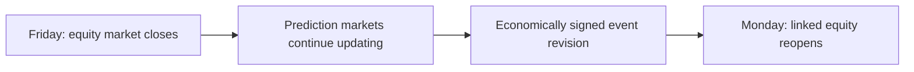

# Closed for the Weekend

### Public companion code for prediction-market and equity price-discovery research

When U.S. equity markets are closed over a weekend, prediction markets can continue to incorporate information about real-world events. This project studies whether those economically relevant probability revisions are reflected in the reopening prices of linked public firms.

This is a deliberately scoped public companion to a larger research workflow. It demonstrates the research design, data-quality safeguards, and reusable signal construction without releasing licensed market data, confidential source materials, or the reviewed event--firm mapping.



## What this repository contains

| Area | Public component |
| --- | --- |
| Research design | A clear description of the hard-closure timing structure and its interpretation. |
| Signal construction | A compact Python function that turns before/after probabilities into economically signed probability revisions. |
| Data contracts | Schema checks that reject missing columns, invalid probabilities, and invalid event--firm signs. |
| Reproducibility | Deterministic SHA-256 input-manifest utilities and tests. |
| Jupyter walkthrough | A fully synthetic notebook that creates and visualizes an illustrative weekend event--firm panel. |

## Quick start

The repository is designed to be opened in JupyterLab.

```bash
conda env create -f environment.yml
conda activate prediction-market-price-discovery
jupyter lab
```

Then open `notebooks/01_hard_weekend_design_demo.ipynb` and choose **Run All Cells**. Its data are generated locally from a fixed random seed, so the example is safe to share and reproducible.

## Repository map

```text
docs/                 Research-design, architecture, data-policy, and notebook notes
notebooks/            Public Jupyter walkthroughs
src/                  Small reusable validation, manifest, and signal utilities
tests/                Automated checks for the public utilities
data/sample/          Synthetic illustrative data only
environment.yml       Reproducible Python/Jupyter environment
```

## Research design in brief

The empirical idea is not that prediction markets mechanically cause equity returns. Rather, the weekend closure provides a clean timing environment: the prediction market may react to news while the linked equity cannot trade.

For each economically defensible event--firm link, the workflow calculates a prediction-market probability revision and applies a reviewed economic sign. That puts heterogeneous links on a common scale: a positive signed revision is favorable to the linked firm regardless of whether the underlying event itself is good or bad.

The full research workflow adds canonicalization, input freezes, peer-adjusted outcomes, fixed effects, diagnostics, and randomization-based checks. See [the methodology note](docs/methodology.md) and [the architecture note](docs/architecture.md) for the public explanation.

## Public-data policy

This repository intentionally excludes:

- licensed or raw market data, trade caches, and vendor extracts;
- API keys, credentials, and local machine configuration;
- reviewed mapping ledgers, audit workbooks, and confidential research artifacts;
- the protected empirical panel and paper-result tables.

All files under `data/sample/` and all values generated in the public notebook are illustrative. They do not reproduce research estimates or constitute a trading strategy. Details are in [docs/data-policy.md](docs/data-policy.md).

## Current status

The public companion currently focuses on transparent design and engineering primitives. Future additions will remain public-safe and may include selected robustness demonstrations, timing diagnostics, and visualization templates using synthetic or appropriately shareable data.
