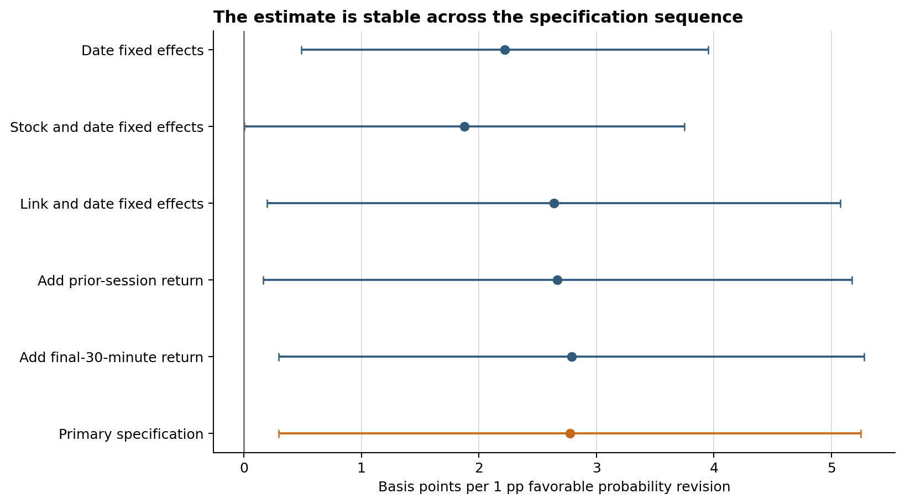
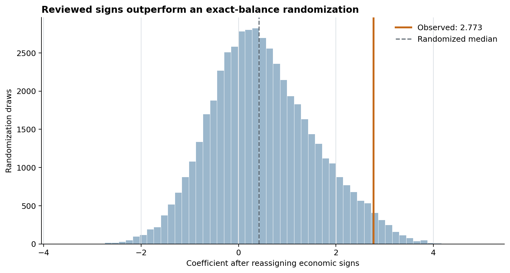

# Closed for the Weekend

### Prediction markets as an upstream layer of price discovery

U.S. equities stop trading over the weekend, but prediction markets do not. I use that recurring closure to ask whether probability revisions on Polymarket and Kalshi are reflected in the reopening values of economically linked public firms.

The main estimate is a within-link regression: a one-percentage-point favorable prediction-market revision is associated with a **2.77 basis-point favorable peer-adjusted stock reopening move**. The estimating sample contains 1,173 observations across 170 reviewed links, 41 stocks, and 91 reopening dates.



## What is in this repository

- two executed notebooks built from empirical result tables;
- the aggregate, non-identifying tables needed to reproduce every displayed figure;
- compact Python utilities for signal construction and result validation;
- tests for the reusable code and repository structure;
- notes on the research design, data sources, and public/private boundary.

Start with:

1. [`01_main_result.ipynb`](notebooks/01_main_result.ipynb) — specification progression and the primary estimate;
2. [`02_randomization_and_robustness.ipynb`](notebooks/02_randomization_and_robustness.ipynb) — sign randomization, peer definitions, influence checks, and the response across horizons.

## Main empirical facts

| Quantity | Result |
| --- | ---: |
| Reviewed prediction-market–stock links | 749 |
| Signed eligible links | 501 |
| Primary estimating observations | 1,173 |
| Primary coefficient | 2.773 bps per probability point |
| Stock × date clustered *p*-value | 0.028 |
| Market × date clustered *p*-value | 0.008 |
| Within-date permutation *p*-value | 0.006 |
| Date-cluster wild-bootstrap *p*-value | 0.007 |

The coefficient remains positive as fixed effects and predetermined controls are added. It is also similar under alternative peer constructions and after removing the most influential links.



## Research design

For each reviewed event–firm link, I measure the prediction-market probability change from Friday 8:00 p.m. to Sunday 8:00 p.m. Eastern. The window ends before some equities can resume overnight trading. Each probability change is multiplied by a reviewed economic sign, so positive values always mean favorable news for the linked firm.

The primary outcome is the linked stock's reopening gap minus the same-date reopening gap of matched, unexposed peers. The regression includes link and reopening-date fixed effects and controls determined before the weekend. This design establishes temporal ordering during signal formation; it does not claim that prediction-market trading itself causes the equity move.

The full specification is documented in [`docs/methodology.md`](docs/methodology.md). The data path is summarized in [`docs/research-pipeline.md`](docs/research-pipeline.md).

## Reproduce the notebooks

Python 3.11 or newer is recommended.

```bash
python -m venv .venv
```

Activate the environment, then run:

```bash
python -m pip install --upgrade pip
python -m pip install -e ".[dev]"
pytest
jupyter lab
```

Both notebooks are already executed, so GitHub displays their tables and figures without requiring a local run.

## Data availability

The files in [`data/derived`](data/derived) are real aggregate outputs from the research pipeline, not synthetic examples. They contain coefficients, standard errors, randomization draws, and sample counts; they do not contain contract-level observations, firm mappings, credentials, or licensed market data.

The underlying minute data come from Polymarket, Kalshi, and Databento. The equity data are licensed, and the merged panel would disclose the reviewed event–firm ledger, so the raw analysis inputs are not redistributed here. [`docs/data-sources.md`](docs/data-sources.md) describes exactly what is and is not included.

## Repository map

```text
data/derived/          Aggregate empirical outputs used by the notebooks
docs/                  Methodology, source, and pipeline notes
figures/               Figures regenerated by the executed notebooks
notebooks/             Main result and robustness analyses
src/pm_price_discovery Reusable validation and signal code
tests/                 Unit and repository checks
```

This is a research repository, not an investment recommendation or production trading system.
