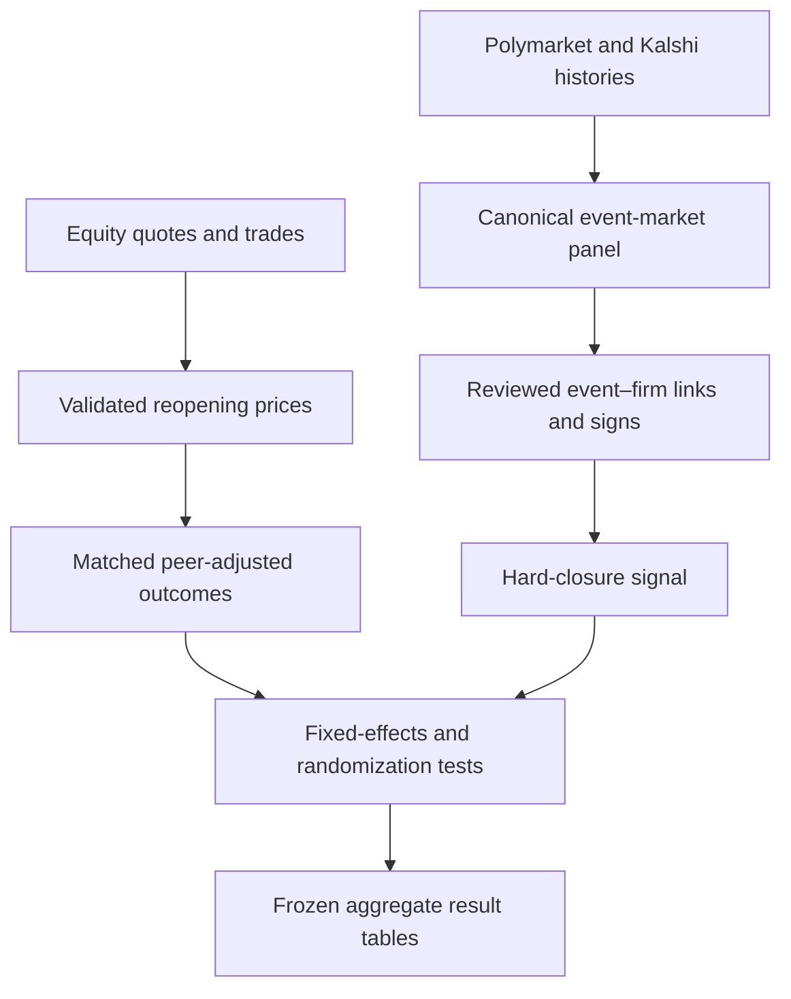

# Research pipeline

## Controls that matter for reproducibility

1. Raw inputs are frozen and hashed before the analysis stages run.
2. Market identifiers and timestamps are canonicalized before merging.
3. Probability paths, equity prices, and event–firm signs are checked against explicit schemas.
4. The quote–trade agreement threshold is calibrated outside the analysis sessions and then frozen.
5. Peer characteristics are measured before the closure window.
6. Main and robustness estimates are written to immutable result tables consumed by the notebooks in this repository.

The public `data/derived` files begin at step 6. They are sufficient to reproduce the displayed figures but cannot reveal individual contracts, firms, or vendor observations.
